### Default Logging Setting
- Secara default Spring Boot melakukan logging ke Console, dan selain itu Spring Boot juga memiki Log Format
- Unit Test Code : LoggingTest
  
  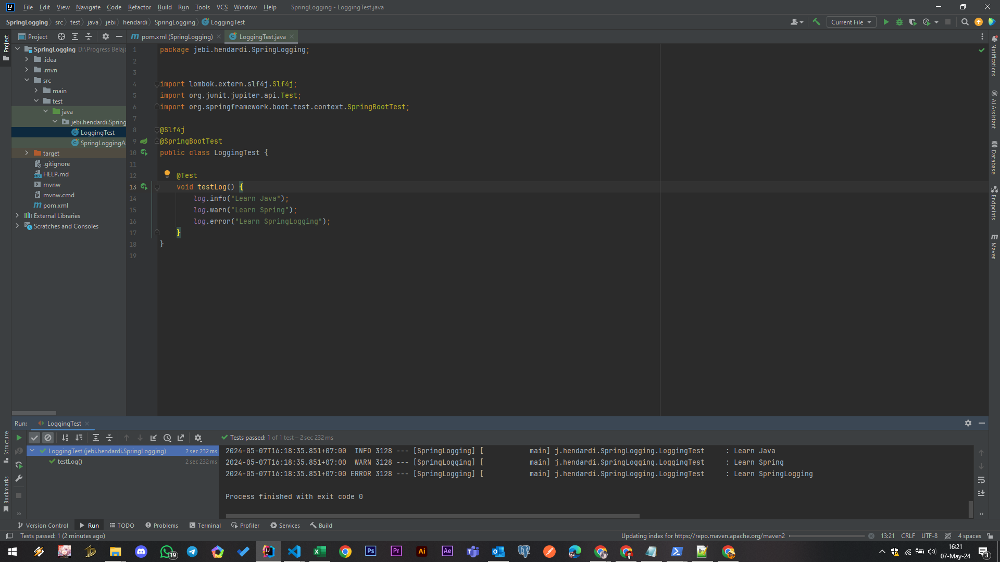

#
### Logging Level
- Saat menggunakan Logback, biasanya kita bisa ubah level dari logging di file logback.xml, namun Spring Boot memiliki fitur dimana kita bisa menggunakan file Spring application.properties untuk mengubah pengaturan Logging nya
- Kita bisa menggunakan prefix logging.level untuk mengubah pengaturan logging level, misal:
- `logging.level.root=info`
- `logging.level.nama.package.nya=warn`
- Code application.test.properties
  
  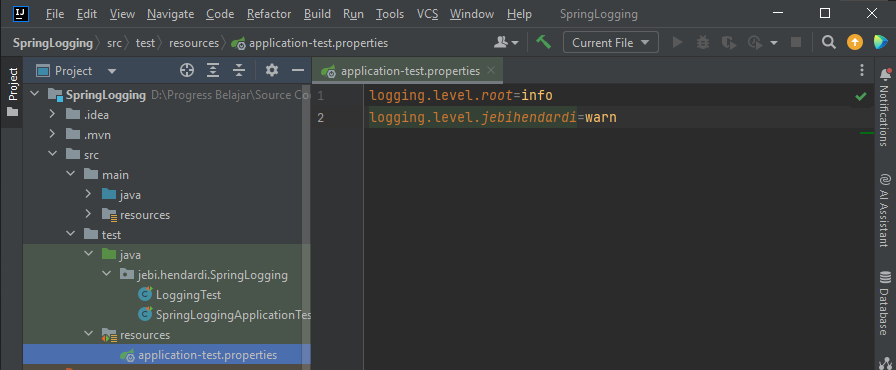

- Unit Test Code : LoggingTest
  
  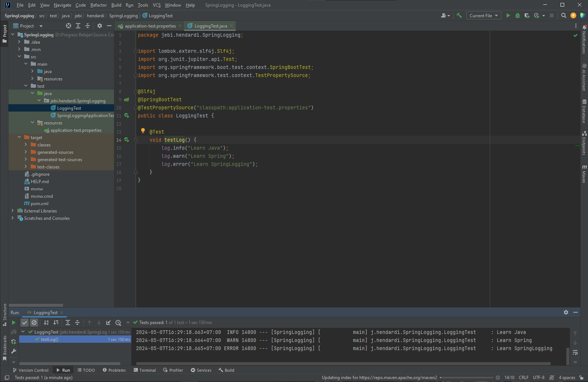

#
### File Output
- Secara default, Spring Boot melakukan konfigurasi logging output hanya ke Console
- Namun Spring Boot memiliki fitur untuk mengaktifkan logging output ke File, dengan cara menggunakan properties :
- `logging.file.name` untuk menentukan nama file output logging, misal application.log atau /tmp/application.log
- `logging.file.path` untuk menentukan nama folder output logging, dan secara otomatis akan menggunakan nama file spring.log, misal jika menggunakan /tmp/, maka secara otomatis file log nya adalah /tmp/spring.log
- Code Application-test.properties
  
    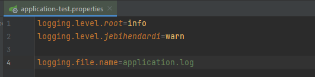

- Unit Test Code : LoggingTest 
  
    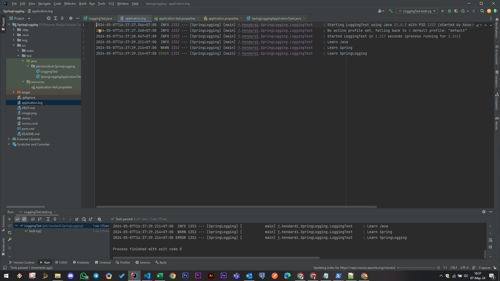

#
### File Rolling
- Spring Boot juga memiliki fitur untuk mempermudah ketika kita ingin melakukan rolling file logging menggunakan Logback
- File Rolling Properties
  
    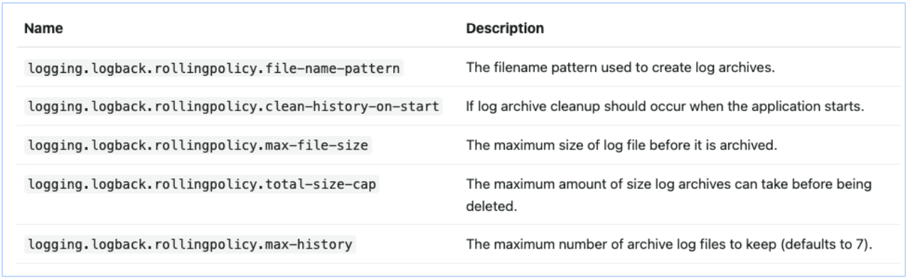

- Code Application-test.properties
  
    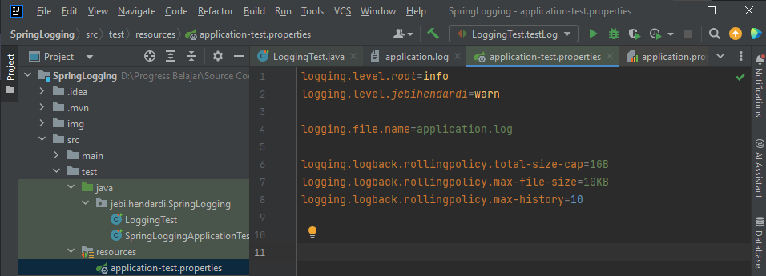

- Unit Test : Long LoggingTest
  
    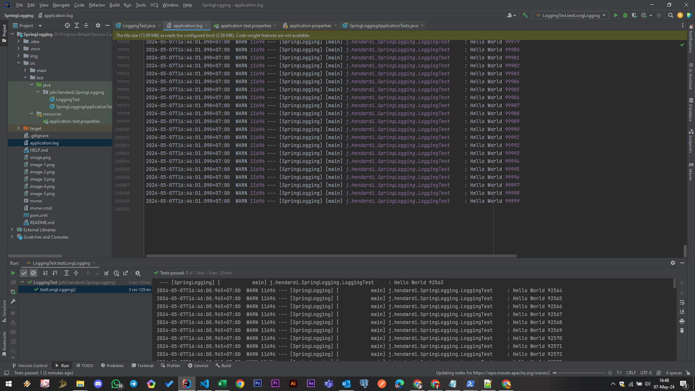

#
### Log Group
- Pada beberapa kasus, kadang kita ingin membuat konfigurasi logging level yang sama untuk beberapa package
- Spring Boot memiliki fitur bernama Log Group, dimana kita bisa membuat nama log group untuk beberapa package
- Keuntungannya, kita bisa menggunakan nama log group tersebut ketika melakukan pengaturan logging level
- Kita bisa menggunakan application properties :
`logging.group.nama=package1,package2,danseterusnya`

- Log Group Spring Boot
    
    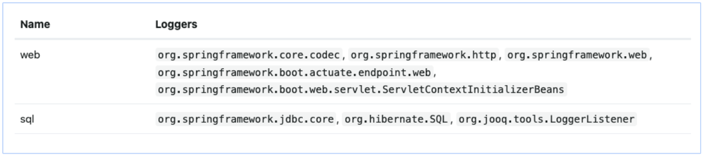

- Code application-test
 
    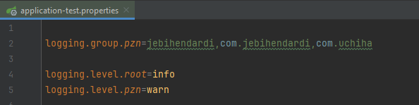

- Unit Test Log Group
  
    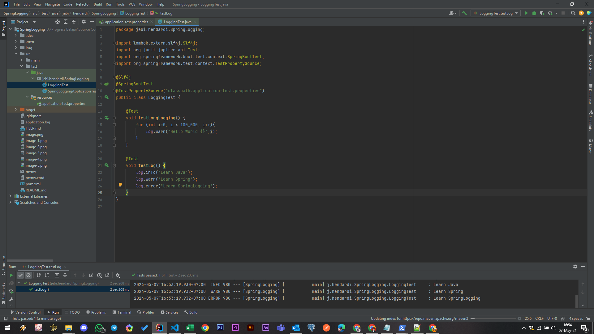

